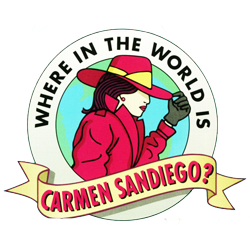

<p align="center">
  <a href="https://www.gatsbyjs.com/docs/quick-start/">
    
  </a>
  <a href="https://fycarmensandiego.tumblr.com/downloads">
    
  </a>
</p>

<h2 align="center">
Carmen Sandiego project scaffolded onto the Gatsby minimal starter.  

Think of it as a light fork.
</h2>

#####  Credit to [JulienVerkest](https://github.com/JulienVerkest/carmen-sandiego) for the MVP to start from :)
---

<h2 align="center">
  🚀🚀🚀 Quick Start 🚀🚀🚀
</h2>

1.  **Create a Gatsby site.**

    Use the Gatsby CLI to create a new site, specifying the minimal starter.

    ```shell
    # create a new Gatsby site using the minimal starter
    npm init gatsby
    ```

2.  **Start developing.**

    Navigate into your new site’s directory and start it up.

    ```shell
    cd my-gatsby-site/
    npm run develop
    ```

3.  **Open the code and start customizing!**

    Your site is now running at http://localhost:8000!

    Edit `src/pages/index.js` to see your site update in real-time!

---

## To Do:
- [ ]  Migrate the CSS to an alternative solution like SASS or CSS-in-JS
- [ ]  Change the current animation links to random giphy animation calls
- [ ]  Audit the current UI with new CSS system in place
- [ ]  Update the current UI based on audit findings
- [ ]  Save and Restore the state of the game in localStorage with possibily to rename each save
- [ ]  Add animation when expiration time i.e. the date is superior at Sunday, 5pm. 
- [ ]  Compress and optimize mp4 animations, mp3 sounds and jpg pictures and store them to cdn
- [ ]  Fix french i18n translations : place, date, end messages, dossiers, typemachine, etc.
- [ ]  Add Japanese i18n translations
- [ ]  Add shortcuts keyboard 
- [ ]  Improve close button design
- [ ]  Fix `eval()` on crime options

## Features:
*Coming soon*